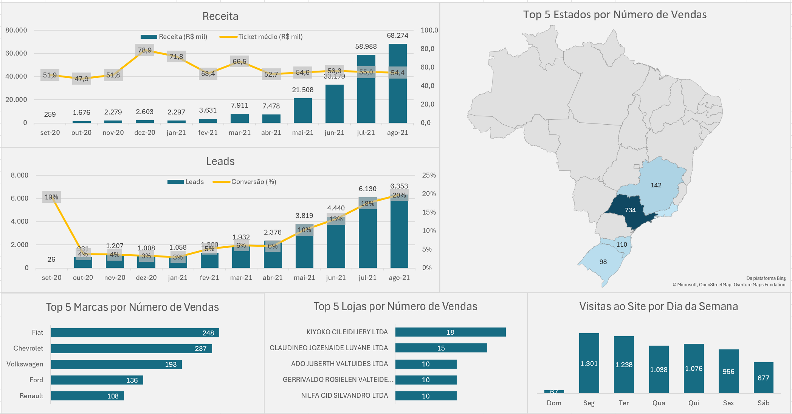

# Dashboard de Acompanhamento de Vendas

Este projeto analisa dados de vendas de carros para acompanhar a evolução dos principais indicadores comerciais e entender como as vendas estão distribuídas por estado, marca e loja.

## Dados utilizados

Os dados utilizados são informações de um sistema de vendas, contendo registros de leads, clientes, produtos, lojas e pagamentos. O período analisado vai de setembro de 2020 a agosto de 2021.

## Ferramentas

- PostgreSQL
- Excel

## Processamento

Os dados foram consultados e agregados no PostgreSQL para calcular os principais indicadores de vendas.

Foram realizadas análises mensais de leads, vendas, receita, conversão e ticket médio, além da distribuição das vendas por estado, marca e loja e das visitas por dia da semana.

## Dashboard

O dashboard apresenta a evolução mensal de leads, vendas, receita, conversão e ticket médio, além das vendas por estado, marca e loja e das visitas por dia da semana.

## Insights

- Leads e vendas apresentaram crescimento ao longo do período analisado.
- A taxa de conversão chegou a 20% em agosto de 2021.
- A receita mensal atingiu R$ 68,274 milhões em agosto de 2021.
- São Paulo apresentou o maior número de vendas em agosto de 2021.
- Fiat foi a marca com maior número de vendas em agosto de 2021.
